# 워게임 Bandit 풀이

url : https://overthewire.org/wargames/bandit/

- overthewire에서 제공하는 워게임
- 각 단계마다 설계된 시스템의 취약점을 찾아서 시스템에 대해 학습
- 얻은 키는 다음 레벨의 패스워드
- 최종 level34 까지 있다
  
## 목차

- ### 0. 접속
1. [Level 0](#Level-0)
   
- ### 1. 파일 읽기
2. [Level 0 → Level 1](#Level-0--Level-1)
3. [Level 1 → Level 2](#Level-1--Level-2)
4. [Level 2 → Level 3](#Level-2--Level-3)
5. [Level 3 → Level 4](#Level-3--Level-4)
   
- ### 2. 파일 찾기
1. [Level 4 → Level 5](#Level-4--Level-5)
2. [Level 5 → Level 6](#Level-5--Level-6)
3. [Level 6 → Level 7](#Level-6--Level-7)

- ### 3. 내용 찾기
4.  [Level 7 → Level 8](#Level-7--Level-8)
5.  [Level 8 → Level 9](#Level-8--Level-9)
6.  [Level 9 → Level 10](#Level-9--Level-10)
   
- ### 4. 데이터 변환   
7.  [Level 10 → Level 11](#Level-10--Level-11)
8.  [Level 11 → Level 12](#Level-11--Level-12)
9.  [Level 12 → Level 13](#Level-12--Level-13)

- ### 5. 네트워크 연결
10. [Level 13 → Level 14](#Level-13--Level-14)
11. [Level 14 → Level 15](#Level-14--Level-15)
12. [Level 15 → Level 16](#Level-15--Level-16)
13. [Level 16 → Level 17](#Level-16--Level-17)
14. [Level 17 → Level 18](#Level-17--Level-18)

- ### -
15. [Level 18 → Level 19](#Level-18--Level-19)
16. [Level 19 → Level 20](#Level-19--Level-20)
17. [Level 20 → Level 21](#Level-20--Level-21)
18. [Level 21 → Level 22](#Level-21--Level-22)
19. [Level 22 → Level 23](#Level-22--Level-23)
20. [Level 23 → Level 24](#Level-23--Level-24)
21. [Level 24 → Level 25](#Level-24--Level-25)
22. [Level 25 → Level 26](#Level-25--Level-26)
23. [Level 26 → Level 27](#Level-26--Level-27)
24. [Level 27 → Level 28](#Level-27--Level-28)
25. [Level 28 → Level 29](#Level-28--Level-29)
26. [Level 29 → Level 30](#Level-29--Level-30)
27. [Level 30 → Level 31](#Level-30--Level-31)
28. [Level 31 → Level 32](#Level-31--Level-32)
29. [Level 32 → Level 33](#Level-32--Level-33)
30. [Level 33 → Level 34](#Level-33--Level-34)

</br>

# 0. 접속

<span style="color: #fff5a1"> 

## Level 0 

</span>

- Level 0 의 목표는 ssh를 이용해서 bandit에 접속하는 것이다.

    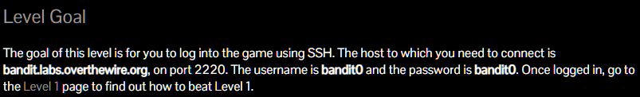

- 아래의 명령어로 bandit0에 접속한다.
  
  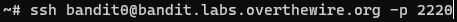

- 앞의 bandit0 부분이 username이다. 다음 단계로 넘어갈 때 username 부분을 변경해주면 된다.


- 다음과 같이 password 입력 창이 나오는데 위에 적혀있듯이 bandit0을 입력해준다.
  
  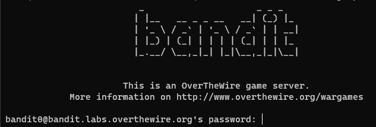

  참고로 패스워드 입력 시에 입력 표시는 화면에 출력되지 않으니 그냥 적으면 된다.

- 다음과 같이 bandit0에 입장하면 성공이다.

    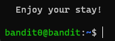


</br>

# 1. 파일 읽기

<span style="color: #fff5a1"> 

## Level 0 → Level 1

</span>

- 목표는 home directory의 readme 파일에 저장되어 있는 패스워드를 읽는 것이다.
  
    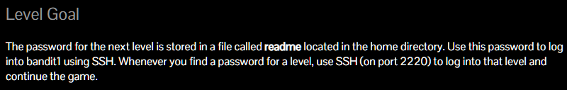

    참고로 directory는 윈도우의 폴더 개념과 같다.

- 리눅스는 접속하면 보통 home directory에서 시작한다.

- ls 명령어를 사용하여 현재 경로에 있는 파일 목록을 확인한다.

- readme 파일이 있기 때문에 cat 명령어를 사용하여 readme 파일을 읽는다.

- 결과로 다음 레벨인 bandit1의 비밀번호를 얻을 수 있다.

    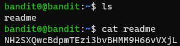

</br>

<span style="color: #fff5a1"> 

## Level 1 → Level 2

</span>

- home directory에 있는 이름이 ```-```인 파일에 패스워드가 저장되어 있는 것 같다.
  
    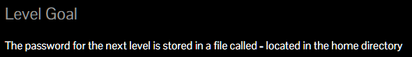


- 전 단계와 같은 방식으로 ls로 파일 목록을 확인하고 cat으로 파일을 읽는다.

    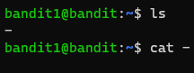

- 하지만 아무것도 뜨지 않는다. → 리눅스에서 ```-```는 특수문자라서 명령어의 인자로 넘겨지지 않는다.
- 그렇다면, ```./``` 문자를 사용할 것이다. 이것은 리눅스에서 '<span style="color: #2ff4a1"> **현재 경로**</span>'를 의미한다. 
  
    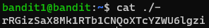

- 이런식으로 입력하면 현재 경로의 ```-``` 파일을 선택하기 때문에 정상적으로 읽을 수 있다.
  
</br>

<span style="color: #fff5a1"> 

## Level 2 → Level 3

</span>

- 이번엔 파일 이름이 'spaces in this filename' 이다. 말 그대로 파일 이름에 공백이 있다.
  
  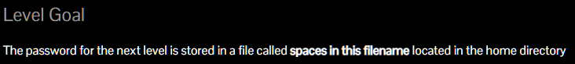

- 리눅스에서 공백으로 인자를 구분하기 때문에 하나의 파일 이름으로 인식하지 못한다.
  
  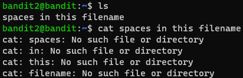

- 방법은 여러 가지가 있을 수 있으나 2가지를 소개한다.
- 파일 이름을 따옴표로 묶는다. (물론 쌍따옴표도 가능하다.)

    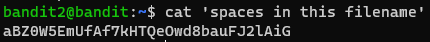

- escape 문자를 사용한다. : 특수 문자를 입력하기 위해서 사용한다.
  
    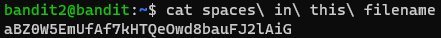

- escape 문자는 보통 앞에 ```\```를 사용하고, 종류가 많으니 검색해보자.


</br>

<span style="color: #fff5a1"> 

## Level 3 → Level 4

</span>

- 패스워드가 inhere 디렉토리의 숨김 파일 내에 있다고 한다.
  
  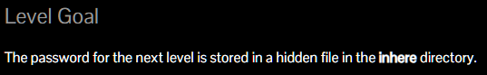

- 먼저 ls로 목록을 확인한 후에 폴더로 이동한다. 
- cd 명령어는 'change directory'의 약자로 경로를 이동하는 명령어이다.
  
  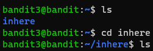

- inhere 디렉토리로 이동된 것을 확인 할 수 있다. 그 후에 ls 명령어로 아무것도 출력되지 않는다.
- 숨김 파일이기 때문에 -a 옵션을 사용한다.
- 명령어에는 여러가지 옵션이 있는데 ls의 -a 옵션은 숨김 파일까지 보여준다.

    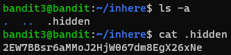

- 그리고 참고로 ```.``` 과 ```..``` 을 볼 수 있는데, ```.``` 은 현재 경로를 의미하고, ```..```은 이전 경로를 의미한다.
- 따라서 상위 디렉토리로 이동하고 싶다면 ```cd ..``` 을 사용한다.
  
</br>

# 2. 파일 찾기

<span style="color: #fff5a1"> 

## Level 4 → Level 5

</span>

- 패스워드는 inhere 디렉토리 안에 사람이 읽을 수 있는 형태로 저장되어 있다.

  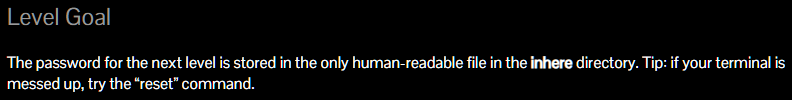

- inhere로 이동했더니 파일이 많다. 그 중 하나를 읽어본다.
  
  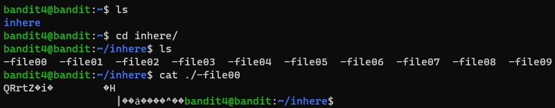

- 글자가 깨져서 출력된다. 사람이 읽을 수 없는 파일이다.

- 이걸 다 읽어보기는 좀 번거로우니까 파일의 타입을 확인하는 file 명령어를 사용할 것이다.
  
  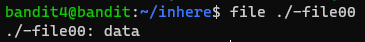

- -file00의 타입은 data 타입이다. 하지만 이걸 전부타 일일히 확인하기는 너무 귀찮다.
- ```*``` 이라는 특수 문자를 사용할건데 전부를 뜻하는 문자이다.

  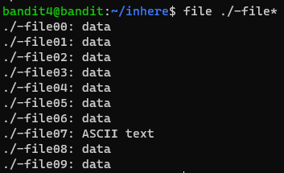

- 위와 같이 ```/-file*```를 입력하면 '**현재 경로의 ```-/file```뒤에 어떤 문자가 오던 전부 다**' 라는 뜻이 된다.
- -file07 만 ASCII text로 된 것을 확인할 수 있다. ASCII문자는 사람이 읽을 수 있다.

  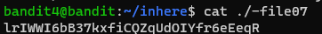

</br>

<span style="color: #fff5a1"> 

## Level 5 → Level 6

</span>

  
</br>

<span style="color: #fff5a1"> 

## Level 6 → Level 7

</span>

  
</br>

# 3. 내용 찾기

<span style="color: #fff5a1"> 

## Level 7 → Level 8

</span>

  
</br>

<span style="color: #fff5a1"> 

## Level 8 → Level 9

</span>


  
</br>

<span style="color: #fff5a1"> 

## Level 9 → Level 10

</span>


